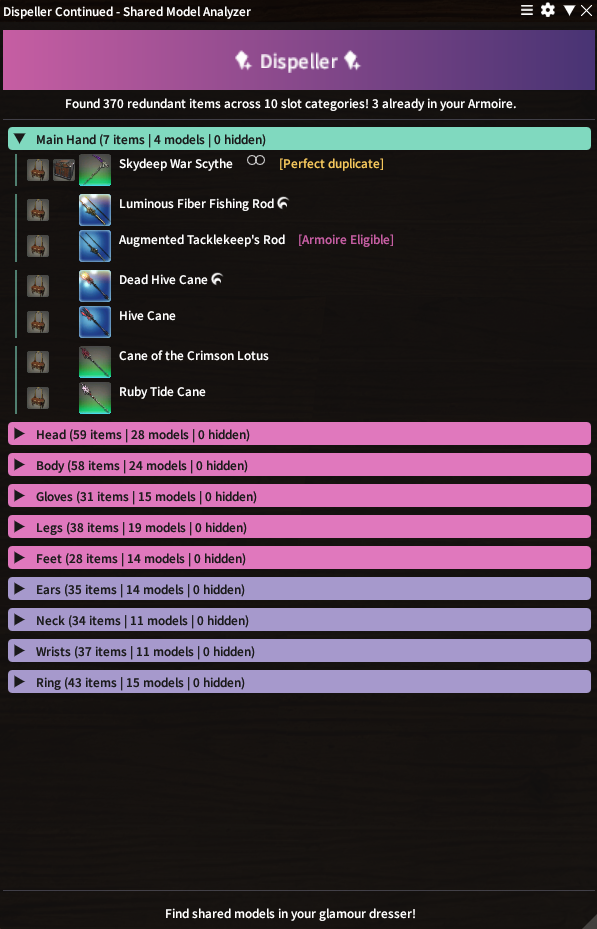

# Dispeller Continued

A Dalamud plugin for FINAL FANTASY XIV that helps you clean out your Glamour Dresser by
identifying items that share the same visual model.

A lot of what fills your dresser may be redundant - different items that look identical once
equipped. Dispeller scans the dresser and the Armoire, groups items by equipment slot and
model, and shows you the groups where more than one item resolves to the same appearance.
Keep one, dispel the rest, free up space for more.

Each row carries the game's own Glamour Dresser and Armoire icons to show where the item is
being kept. An item is flagged as a perfect duplicate when a second copy exists - in the
Armoire, which stores it for free, or in the dresser itself. An item that could move to the
Armoire but hasn't is flagged too.

Matching is on the *mesh* by default, so recolours and material variants count as redundant;
a setting tightens it to require the variant to match too. HQ entries are matched against
their normal-quality twins and marked with the HQ glyph.

Items linked to an outfit are tagged `[Outfit]`, so it's clear that discarding one breaks up
a set - the tag can be switched off in the settings. An outfit held under more than one
dresser grouping gets its own section, since the second grouping spends dresser slots on an
outfit you already have.

<p align="center">
  
</p>

This is a fork of [pupwife/DispellerPlugin](https://github.com/pupwife/DispellerPlugin),
maintained for personal use only.

*I used Claude (Opus 5, max effort) to update to the current Dalamud API level (15) to work
on the current patch at time of commit (7.55).*

*I make no claims of ownership over any of the code in this repo.*

*This is a strictly "**works on my machine**" fork, with no guarantees that it will work on
yours.*

## Installing

This plugin is not (and never will be) in the official Dalamud repository. To install it,
add this URL in Dalamud under **Settings → Experimental → Custom Plugin Repositories**:

```
https://raw.githubusercontent.com/Dryness/DispellerPlugin/master/repo.json
```

## Usage

`/dispeller` to open the GUI. It will be empty until you open your Glamour Dresser once, at
which point it will automatically populate with both the dresser and armoire.
Opening just the armoire (to store or remove) will only populate with armoire data.
Updates are real-time as items are added or removed to either.

Both are saved per character, so the results are there the next time you log in without
having to open either again. Anything shown from a saved copy is labelled with the date it
was taken, since the contents may have changed since — open the dresser or the Armoire and
its label clears.

Right-click an item to hide it. A hidden item is left out of the duplicate check entirely,
so whatever it matched disappears with it.

`/dispeller config` opens the settings, as does the cog in the window's title bar and the
gear beside the plugin in Dalamud's installer. From there the window can open with the
Glamour Dresser, hide itself on a zone change, stop treating recolours as duplicates, or
list hidden items again so they can be right-clicked back.

---

## Some worthwhile notes

- The whole `PrismBoxItems` array is live. `UsedSlots` is not an item count — bounding the
  scan by it drops real items, including every boot and accessory. It doesn't track the
  contents either, so it can't be watched for changes. The dresser is polled and fingerprinted
  instead.
- `Slot` is an outfit/set identifier, not a dresser position: an "Attire" bundle and all its
  pieces share one. De-duplication keys on `ItemId` *and* `Slot`, so the same item stored in
  two groupings stays two entries — keying on `ItemId` alone hid real second copies.
- Outfit bundles sit at `EquipSlotCategory` row 0. They aren't containers: pieces stay in
  their own slots and are merely linked, so `MirageStoreSetItem` is what says which piece
  belongs to which outfit.
- HQ entries are stored at `ItemId + 1,000,000`, and the `Item` sheet only carries the base
  row. IDs are normalised for sheet lookups only, so an HQ item and its normal-quality twin
  stay two dresser entries, as the game shows them.
- Weapons now match on the mesh, as gear always has. Comparing every model field made a
  weapon match nearly impossible.
- `Cabinet.IsItemInCabinet` is keyed by `Cabinet` sheet row, not by item id, and roughly a
  quarter of that sheet is placeholder rows with no item attached. The Armoire is polled and
  fingerprinted like the dresser, since storing and withdrawing give no change signal either.

---

## AI usage declaration

*Claude thought that this section would be useful. If anyone who knows what they're doing
cares for the justifications behind why anything was changed the way they were, here you
go.*

---

Per the [Dalamud AI usage policy](https://dalamud.dev/plugin-publishing/ai-policy), this
fork discloses its level of AI involvement.

**Level: Copilot** — AI implements while the human plans and reviews.

### What that covers

Work in this fork was carried out with Claude (Anthropic) acting as the implementer, under
human direction and review at each step. Specifically:

- The human set the scope and made the decisions: what to investigate, when to stop
  investigating and write code, what to commit, what to defer.
- The AI wrote the code changes, ran the builds, and analysed the diagnostic output.
- **All empirical validation was performed by the human in-game.** Conclusions were settled
  by live experiments and by scanning with instrumented builds, checked against a dresser
  the human had counted by hand.
- Each change is reviewed before being committed, and the reasoning behind it is recorded
  in the commit messages and in code comments rather than left implicit.

### Scope note

This declaration covers work done in this fork. Code inherited from the upstream
repository is not covered by it.

## Credits

Original plugin by **pupwife**. Built on [Dalamud](https://github.com/goatcorp/Dalamud)
and [FFXIVClientStructs](https://github.com/aers/FFXIVClientStructs).

Licensed under AGPL-3.0-or-later; see [LICENSE](LICENSE).

```
Copyright (C) 2025 pupwife
Copyright (C) 2026 Dryness
```

FINAL FANTASY XIV © SQUARE ENIX CO., LTD. This project is not affiliated with or endorsed
by Square Enix.
